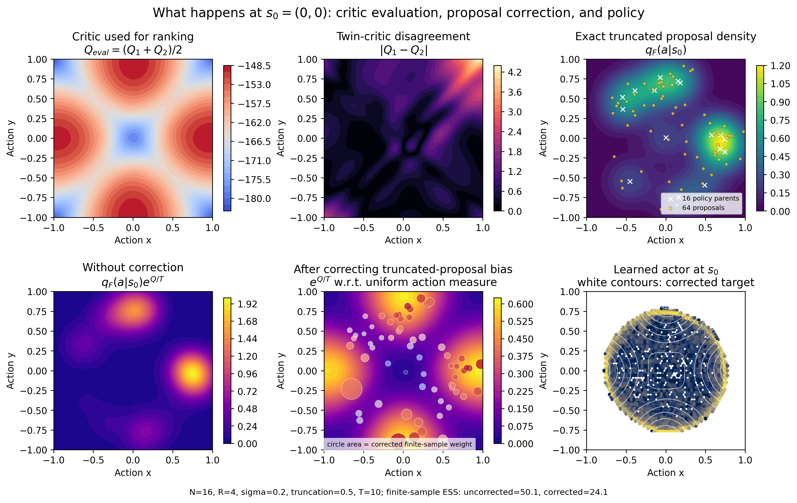
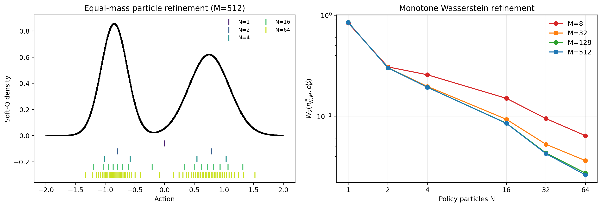

# OptiQ

**Density-corrected value-weighted optimal transport for one-step implicit
policies in online reinforcement learning.**

OptiQ fits a likelihood-free implicit actor to a critic-induced Boltzmann
target. For each state, it samples policy particles and local action proposals,
corrects the proposal-sampling bias, solves a value-weighted optimal transport
problem, and distills categorical assignments into the actor. The learned actor
retains one-step inference and does not require policy-density evaluation.



## Method

The actor is reparameterized as

$$
a=\mu_\theta(s,z),\qquad z\sim\mathcal N(0,I).
$$

Given policy particles $x_i$ and proposals $y_j\sim q_F(\cdot\mid s)$, OptiQ
constructs the density-corrected value weights

$$
w_j\propto\exp\left(\frac{Q(s,y_j)}{\tau}-\log q_F(y_j\mid s)\right).
$$

The target weights and uniform policy-particle marginal define an entropic OT
problem. A target is sampled from each conditional transport row and regressed
by squared error. The correction is enabled by default; disabling it is exposed
only as an ablation.

## Installation

```bash
git clone git@github.com:Yonsei-DILLab/OptiQ.git
cd OptiQ
conda env create -f environment.yml
conda activate optiq
```

Alternatively, install into an existing Python environment:

```bash
pip install -e ".[experiments,logging]"
```

Install the CUDA-enabled JAX build appropriate for the local CUDA version when
training on GPU; see the official JAX installation instructions.

## Online Training

The canonical CLI trains the density-corrected method:

```bash
optiq-train \
  --env HalfCheetah-v4 \
  --seed 1 \
  --num-particles 16 \
  --proposals-per-particle 5 \
  --proposal-std 0.2 \
  --temperature 0.25 \
  --density-correction
```

Runs are written to `outputs/`. Pass `--wandb-project PROJECT` for W&B logging.
Use `--no-density-correction` only for the proposal-bias ablation.

## Controlled Experiments

The finite-particle experiments isolate the theoretical claims from critic and
online-learning error:

```bash
python -m experiments.boltzmann_projection.particle_refinement
python -m experiments.boltzmann_projection.neural_distillation
python -m experiments.boltzmann_projection.density_correction
```

The four-way task evaluates multimodal extraction and proposal-density
correction. Reproduction commands are documented in
[`experiments/four_way_multigoal`](experiments/four_way_multigoal/README.md).



## Repository Layout

```text
optiq/                               Core actor, critic, OT, and training code
experiments/boltzmann_projection/    Analytic and neural controlled studies
experiments/four_way_multigoal/      Multimodal online-control study
assets/figures/                      Selected paper-facing figures
outputs/                             Generated runs and checkpoints (ignored)
```

## Status

This repository is research code under active development. The controlled
experiments are included now; final large-scale benchmark scripts and reported
scores will be added after the evaluation protocol is frozen.
