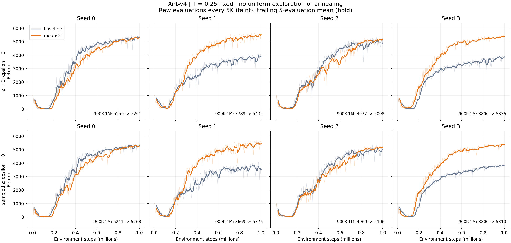
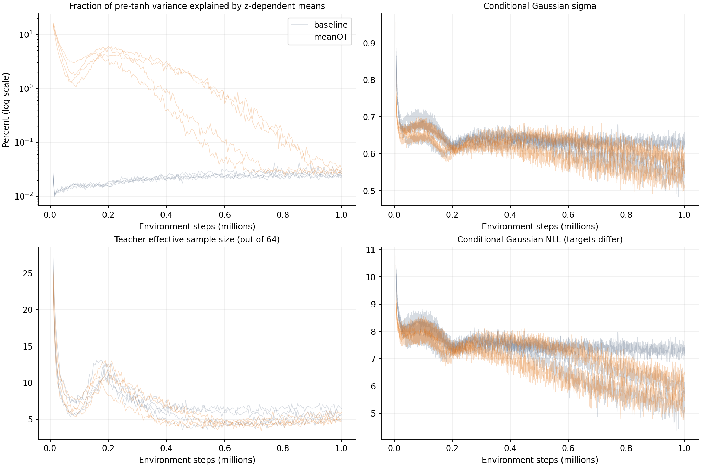

# v4 mean-action OT 대조: 4시드 1M 결과

2026-09-13. 학습 코드·체크포인트·현재 실행 중인 큐를 수정하지 않고 완료된 결과를 분석했다.

**OT student 위치만 평균 행동으로 바꾼 대조에서, 기존 낮은 성능의 두 시드가 개선되어 이번 네 시드는 모두 후반 평균 약 5,100–5,400점을 기록했다. 초반 평균 분화도 크게 증가했다. 다만 모든 시드가 더 빨리 학습한 것은 아니며, 후반에는 z별 평균 차이가 다시 작아진다.**

## 비교와 검증

- Ant-v4, T=.25 고정, actor/critic 256x2, seed 0·1·2·3, 각 1M step.
- 추가 uniform 탐색 p=0, annealing 없음. Gaussian collection, sigma teacher와 full-row conditional NLL, plain TD, M16/K64, beta1, OT .25/100, 초기 sigma=.5 유지.
- 유일한 코드 개입: OT student 비용 입력 `tanh(mu + sigma*epsilon)` → `tanh(mu)`. Epsilon draw와 RNG 분할은 보존했다.
- 대조 source: 보존 commit `6f5c987` + manifest에 고정한 별도 patch. 기존 baseline은 이전 완료 결과를 재사용했다.
- 두 평가 모두 epsilon=0. zero-z와 매 행동마다 z를 샘플링하는 평가를 각각 집계했다. 두 variant의 전체 평가 시점·환경 seed·정책 seed 배열이 일치하고, 학습 전 평가 reward도 정확히 일치했다.
- 8개 run 모두 1M checkpoint, 995,000 updates, 종료 기록, 각 모드 201×10 episode 평가를 다시 검증했다. 기록된 backup entropy 항은 모두 0이다. Source/config/hash 검사도 통과했다.

[등록 manifest](/root/optiq-experiments/ant_v4_mean_ot_T025_20260912T235059Z/manifest.json) · [검증 기록](analysis/mean_ot_results_20260913/verification.json)

## 성능: 900K–1M의 21회 평가 평균

평가 한 번의 마지막 점수 대신 사전에 정한 후반 구간을 사용한다. 각 평가의 10 episode 평균을 구한 뒤 21개 평가를 평균하고, 네 시드는 같은 가중치로 집계했다.

| Seed | 기존 zero-z | meanOT zero-z | 변화 | 기존 sampled-z | meanOT sampled-z |
|---|---:|---:|---:|---:|---:|
| 0 | 5,259 | 5,261 | +2 | 5,241 | 5,268 |
| 1 | 3,789 | 5,435 | +1,646 | 3,669 | 5,376 |
| 2 | 4,977 | 5,098 | +121 | 4,969 | 5,106 |
| 3 | 3,806 | 5,336 | +1,530 | 3,800 | 5,310 |
| 평균 | **4,458** | **5,283** | **+825 (+18.5%)** | **4,420** | **5,265 (+19.1%)** |

Zero-z 후반 성능의 시드 간 표본 표준편차는 771 → 142점이다. 이는 시드 간 변동이며 신뢰구간이나 episode 표준편차가 아니다. 기존 3,800점 부근의 저성능 시드 두 개가 이번 네 시드에서는 나타나지 않았다. 시드 수가 4개이므로 앞으로 모든 seed의 실패가 사라진다는 보장은 아니다.

1M 마지막 평가만 보면 zero-z 네 시드 평균은 4,590 → 5,443, sampled-z는 4,632 → 5,409다.

옅은 선은 5K마다 기록한 원래 평가값이고, 굵은 선은 연속 5개 평가의 이동평균이다. 점을 덜 표시해 급락을 숨기지 않았다. [수치 표](analysis/mean_ot_results_20260913/returns_by_seed.csv) · [PDF](analysis/mean_ot_results_20260913/returns_all_seeds.pdf)

## 학습 속도와 급락

3회 연속 3,000점을 넘기기 시작한 zero-z 평가 시점:

| Seed | 기존 | meanOT |
|---|---:|---:|
| 0 | 360K | 395K |
| 1 | 470K | 310K |
| 2 | 405K | 475K |
| 3 | 430K | 320K |

시드 1·3은 빨라졌지만 0·2는 느려졌다. 0–1M 전체 곡선의 step 적분 평균은 2,942 → 3,373점(+14.7%)이지만, 시드 0은 3,454 → 3,178, 시드 2는 3,137 → 2,964점으로 감소했다. 따라서 개선을 모든 시드의 수렴 가속이라고 부르면 틀린다.

초기 50–100K 부근의 낮은 성능 구간도 남아 있다. 후반 저성능 고착이 완화된 것과 초기 탐색 지연이 완전히 사라진 것은 다르다.

급락 역시 0은 아니다. Zero-z의 300K 이후 5개 평가 이동평균에서 이전 최고점 대비 최대 하락은 시드 순서대로 기존 234·406·543·405점, meanOT 247·287·536·286점이다. MeanOT seed 2는 원래 5K 평가값에서 한 번에 약 1,507점 떨어진 구간도 있지만 회복했고 후반 평균은 5,098점이다. 이번 결과에 지속적인 후반 붕괴는 관측되지 않았지만 짧은 변동은 남았다. 이 하락 통계는 설명을 위해 계산한 지표이며, 학습 중단 조건으로 사용하지 않았다.

## 평균 분화: 초기에는 커지고 후반에는 작아짐

로그 지표는 `E_s[sum_d Var_z(mu_d) / (sum_d Var_z(mu_d) + sum_d E_z(sigma_d^2))]`이다. 로그에서 5K–50K 구간 평균은 기존 0.0141% → meanOT 7.3866%, 50K–200K는 0.0157% → 3.1743%였다. 900K–1M에는 0.0255% → 0.0331%로 차이가 작아졌다. 서로 다른 상태를 방문하므로 로그만으로 상태 효과를 제거할 수는 없다.

이를 검산하기 위해 8개 run의 저장된 50K probe에서 각각 16개씩, **공통 128개 관측과 상태당 동일한 z 128개**를 모든 actor에 넣었다. 모델 업데이트나 env.step은 수행하지 않았다. 5,001·50K·100K·250K·1M의 총 40개 actor를 읽었다.

| 공통 상태에서의 지표, 4시드 평균 | 기존 50K | meanOT 50K | 기존 1M | meanOT 1M |
|---|---:|---:|---:|---:|
| Mean-action spread | .01927 | **.28158** | .02453 | .03046 |
| Pre-tanh mu 절대 분산 합 | .000507 | **.112484** | .001290 | .002194 |
| 전체 pre-tanh 분산 중 mu 비중 | .0152% | **3.2977%** | .0199% | .0321% |
| Sigma 평균 | .6602 | .6498 | .9175 | .9440 |

Mean-action spread는 `E_s sqrt(sum_d Var_z[tanh(mu_d(s,z))])`다. 50K에서 spread는 14.6배, 절대 mu 분산은 약 222배다. Sigma는 거의 비슷하므로 분모인 sigma가 줄어서 생긴 비율 착시로 설명되지 않는다. 250K에서도 spread는 .02070 → .31380으로 차이가 유지된다.

1M에서는 공통 상태와 실제 학습 로그 양쪽 모두 평균 차이가 작다. 따라서 **이 대조가 다양한 mixture mean을 학습 끝까지 유지했다는 결론은 성립하지 않는다.** 공통 상태 표의 1M sigma는 초기 상태 bank에 다시 적용한 값이다. 실제 후반 replay에서 기록된 sigma 평균은 기존 .5952, meanOT .5662였으며, 두 수치를 서로 다른 상태 분포의 측정임을 밝히지 않고 혼용하면 안 된다.

[학습 로그 집계](analysis/mean_ot_results_20260913/training_metrics.csv) · [공통 상태 체크포인트 진단](analysis/mean_ot_results_20260913/checkpoint_diagnostics.csv) · [입력 및 방법 검증](analysis/mean_ot_results_20260913/checkpoint_verification.json)

## 가설에 대해 말할 수 있는 범위

이 결과는 NLL 수식 자체를 바꾸지 않고 **OT 배정 방식에 개입해 초기 평균 분화와 후반 저성능 시드 양상을 함께 개선한 full-training 대조 증거**다. 초기 분화 변화는 기존 고정 critic 진단에서도 확인했으며 이번 실제 학습에서도 재현됐다.

가장 자연스러운 해석은 초기 평균 분화가 달라지면서 행동·수집 데이터·critic·학습 경로가 달라졌다는 것이다. 그러나 이번 개입은 그 전체 경로를 함께 바꾼다. 분화 증가만이 성능 개선을 매개했는지, sigma·teacher coverage·critic 변화가 각각 얼마나 기여했는지는 분리하지 않았다. 모든 환경·온도에서의 개선, v1과의 전체 격차 해소, 또는 Q-reference marginal 적합도 향상을 증명한 실험도 아니다.

후반에 평균이 비슷해지는 것이 좋은 정책으로의 집중인지, 여전히 표현력을 잃는 현상인지는 평균 분산만으로 정할 수 없다. 원래 제시한 sigma-only mixture 반례도 그대로 유효하므로 mean-only OT를 일반적인 분포 보존 해법으로 확정하지 않는다.

W&B meanOT: [seed 0](https://wandb.ai/OptiQ/v4-test/runs/wxmgndms), [seed 1](https://wandb.ai/OptiQ/v4-test/runs/64rbv8fc), [seed 2](https://wandb.ai/OptiQ/v4-test/runs/re18it11), [seed 3](https://wandb.ai/OptiQ/v4-test/runs/t0vcnuz3).

대조는 03:41 UTC에 모두 완료됐고 큐는 예정대로 다음 uniform000/anneal20K 4시드로 넘어갔다. 이번 결과 확인에서는 큐나 학습 설정을 바꾸지 않았다.
