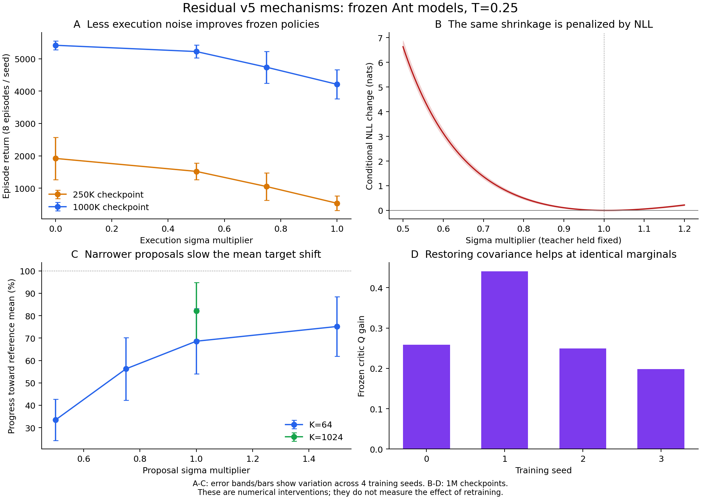

# v5 mean OT 이후의 학습 지연: 수치 진단

작성일: 2026-09-13. 이 문서는 저장된 Ant 모델의 수치 진단 기록이며,
전체 학습곡선 차이의 단일 원인을 확정한 보고서가 아니다.

분석 대상은 당시 mean OT 모델(**Sinkhorn epsilon=.25, gradient clip=2.0**)이다.
후속 사용자 요청으로 바뀐 **epsilon=.1 / no-clip** 기본값이나 현재 temperature
grid의 결과를 이 문서가 평가한 것은 아니다. 해당 실험 설정은
[EXPERIMENTS_KO.md](EXPERIMENTS_KO.md)에 별도로 기록한다.

## 먼저 구분할 점

Mean OT가 고친 것은 student의 수송 위치에 들어가던 Gaussian epsilon이다.
확인된 구조적 충돌은 **조건부 NLL이 학습한 하나의 sigma가 환경 실행,
TD 다음 행동, teacher 후보 생성에 함께 쓰인다는 것**이다.
저장된 실제 모델에서 sigma를 줄이면 보행 보상은 개선되지만,
같은 Q 목표를 향한 유한 후보 teacher의 평균 이동은 약해진다.
또한 그 축소를 현재 NLL은 손실 증가로 평가한다.
이 세 방향의 충돌은 수치 개입으로 각각 확인했다.

다만 이 결과를 "NLL이 v1 대비 학습 지연의 전부를 일으켰다"거나
"v5는 6,000점을 넘을 수 없다"는 주장으로 확대할 수는 없다.
같은 256x2 v1 전체 시드와 비교하면 관측된 v5의 후반 표본 평균은 더 낮지 않다.
이것은 모집단 성능이 동등하거나 더 좋다는 통계적 증명이 아니다.
평균 행동이 학습되는 전체 속도에 각 요인이 기여한 비율은 이번 분석으로 식별하지 못했다.

## 1. 비교 기준을 맞추면 얼마나 느린가

온도 .25 고정, 256x2, 추가 uniform 없는 완료 기록이다. v1은 anchor=true,
v5는 mean OT 전환 대조 4개이며 v5와 학습 의미가 같은 보존 모델을 사용했다.
v1의 온도 annealing 기록을 고정 .25 기록에 섞지 않았다.

| 지표 | v1 5시드 | mean OT / v5 4시드 |
|---|---:|---:|
| 900K–1M 평균 평가 보상 | 5,179 | 5,265 |
| 3회 연속 3,000점 도달 step의 시드 평균 | 335K | 345K |
| 위 도달 step의 시드 중앙값 | 285K | 340K |
| 0–1M 평가곡선 시간 평균 | 3,665 | 3,368 |

두 열 모두 z 샘플링 평가이며 v5는 epsilon=0이다. v5 zero-z 후반 평균은
5,283이다. 평균과 중앙값을 섞으면 지연 정도를 잘못 설명하게 된다.
이전 작업 메모의 v5 도달 중앙값 약 375K는 원자료 재집계 결과와 달라
이 표의 340K로 바로잡았다.

시드 전체를 재표집한 소표본 bootstrap에서 v5−v1의 후반 평균 차이
95% 구간은 약 [-445, +924], 평가곡선 시간 평균 차이는 [-827, +311]이었다.
이는 동등성 증명도, 알고리즘 인과 효과 추정도 아니다. 시드 수가 적고
기존 v1 학습은 MuJoCo 3.3.0, 현재는 2.3.7이며 여러 알고리즘 요소가 다르다.
256x3 v1의 더 높은 기록을 256x2 v5와 같은 조건으로 취급할 수도 없다.

v5 네 시드 모두 800K–1M 구간에서 평가곡선의 기술적 선형 추세가 양수였다.
따라서 현재 확인한 것은 1M 예산 안의 성능과 지연이며, 6,000점의 점근 상한이 아니다.

근거: `benchmark_matched_width.csv`, `benchmark_audit.json`, `late_curve_trend.csv`.

## 2. NLL이 무엇을 유지하게 하는가

한 OT 행의 teacher pre-tanh 평균과 분산을 m, V라 하면 좌표별 NLL은

\[
L=\frac{(\mu-m)^2+V}{2\sigma^2}+\log\sigma+\text{const}.
\]

고정 teacher와 자유로운 출력에 대한 최적해는 mu=m, sigma²=V이다.
즉 sigma가 작아지지 않는 것이 반드시 optimizer 실패는 아니다.
NLL은 배정된 분포의 잔차 분산을 보존하도록 요구한다.

특히 student 평균들이 같으면 mean OT 비용 행도 같다. Entropic OT의
최적 행 조건부분포는 모두 teacher weights w가 된다. 이때 각각의 학생은
같은 전체 평균과 잔차 분산을 학습한다. 다양한 z별 평균이 목표의 구조를
나눠 표현하지 못하면 그 변동이 각 Gaussian의 sigma로 남는다.

일반적인 조건부 OT NLL을 정확한 marginal forward KL이라고 부르는 것은
부정확하다. 이는 배정된 조건부 분포의 likelihood 적합이다. 모든 component가
같아 단일 Gaussian으로 축약되는 경우에는 marginal forward KL의 moment
matching과 일치한다. SAC의 reverse KL 목적과 일반적으로 같지 않다.

고정 teacher에서 sigma를 k배로 바꾸는 손실 차이는 정확히

\[
\Delta L(k)=\sum_d\left[\frac{A_d}{2}(k^{-2}-1)+\log k\right],
\quad A_d=\frac{(\mu_d-m_d)^2+V_d}{\sigma_d^2}.
\]

생산 코드의 `conditional_ot_nll`과 이 식을 직접 대조했다. 검사한 12개
체크포인트에서 최대 절대 차이는 약 2.7e-15였다. sigma 축소가 출력 범위
clipping 때문에 무효가 되는 경우도 검사 상태에서는 없었다.

## 3. 같은 모델의 실행에서는 sigma 축소가 실제로 도움이 된다

4개 학습 시드, 체크포인트별/설정별 8개 평가 episode를 사용했다.
환경 초기 seed와 z/epsilon 난수열을 맞췄고 actor와 critic은 업데이트하지 않았다.
z는 매 행동마다 샘플링한다. 아래 k는 epsilon에 곱하는 sigma 배수다.

| 실행 배수 k | 250K 평균 보상 | 1M 평균 보상 |
|---|---:|---:|
| 1.00, 원래 Gaussian | 535 | 4,210 |
| .75 | 1,051 | 4,737 |
| .50 | 1,520 | 5,222 |
| 0, 조건부 평균 행동 | 1,919 | 5,416 |

1M에서 .75와 .50은 네 시드 모두 원래 Gaussian 실행보다 좋았다.
250K에서 1,000 step까지 도달한 episode 비율은 k=1의 28.1%에서
k=.75의 43.8%, k=0의 81.2%로 바뀌었다. 이는 같은 평균 행동을 갖고도
Gaussian 실행이 좋은 보행을 유지하는 경험을 줄일 수 있음을 직접 보여준다.
다만 이를 재학습했을 때의 평가곡선 변화로 환산하지 않았다.

동일한 sigma=.75 축소에 대한 고정 teacher NLL 변화는 250K +.688 nats,
1M +.855 nats였다. 절반 축소는 각각 +5.985, +6.629 nats였다.
즉 실제 실행을 개선한 방향을 현재의 분포 적합 목적이 선호하지 않는다.
Teacher는 다음 학습 단계에 다시 만들어지므로 이 값은 현재 loss의 국소 비교다.

근거: `rollouts.csv`, `rollouts_mild_shrink.csv`, `operator.csv`,
`mechanism_verification.json`, 각 rollout 검증 JSON.

## 4. 단순히 온도 .25가 엔트로피를 요구하기 때문인가

온도를 그대로 두고 저장된 critic의

\[
F(\pi)=E_\pi Q+.25H(\pi)
\]

도 별도로 평가했다. 이 F는 actor의 실제 NLL이 아니라, 같은 Boltzmann
reference에 대한 reverse KL과 대응하는 비교용 목적이다. Continuous-z 정책을
128개 및 256개 Gaussian component로 근사하고 그 유한 혼합분포의 정확한
밀도, tanh Jacobian, 1,024개 행동 표본을 사용했다.

| sigma 배수 | 250K Delta F | 1M Delta F |
|---|---:|---:|
| .50 | -.042 | -.153 |
| .75 | +.143 | +.137 |
| .90 | +.085 | +.096 |

1M에서 .75의 개선은 네 시드 모두 양수였고 128/256 component 결과도 가까웠다.
따라서 심한 축소의 엔트로피 비용은 실제로 존재하지만, 완만한 축소까지 NLL이
막는 현상을 온도 선호만으로 설명할 수 없다. 목적과 분포 근사 방식의 차이가 있다.
이 비교의 Q는 학습된 critic이며 실제 환경 Q의 정확한 계산이 아니다.

## 5. 목표의 상관관계를 대각 분산으로 바꾸면서 생기는 비용

1M 네 시드의 상태 4개씩에서 exp(mean-Q/.25)의 행동 reference를 별도로
적분했다. 적응 full-covariance Gaussian 70%, 초기 actor moment Gaussian 20%,
uniform action 10%를 proposal로 사용하고 정확한 mixture density로 보정했다.
12회 proposal 적응 뒤 독립적인 131,072개 표본 적분을 두 번 수행했다.
최종 모든 추정의 ESS는 500보다 컸고, 반복 간 log partition 차이는 최대 .0375였다.
이는 정확한 참값 보증은 아니지만 K=64 teacher보다 정밀한 독립 기준이다.

첫 적분 버전은 한 상태에서 ESS가 약 1로 무너졌으므로 결론에 쓰지 않았다.
그 실패 결과도 보존했고 위의 개선된 적분 결과를 사용했다.

Reference의 좌표 간 상관계수 RMS는 시드별 .167/.217/.145/.150이었다.
그 reference의 평균과 좌표별 분산을 동일하게 맞춘 Gaussian 두 개를 만든 뒤,
full covariance를 보존한 경우와 off-diagonal을 제거한 경우를 비교했다.
상관관계만 보존했을 때 저장된 critic의 기대 Q가 시드별
+.259/+.441/+.250/+.198 높았다. 상관관계 제거의 Q 비용을 분리한 결과다.

참고로 Gaussian reference N(m,C)를 대각 Gaussian으로 근사하면 정확히

\[
D_{forward,ii}=C_{ii},\qquad D_{reverse,ii}=1/(C^{-1})_{ii}.
\]

상관관계가 있으면 두 분산은 다르다. Forward moment matching이 유지하는
각 좌표의 폭을 독립적으로 조합하면 reverse KL 최적해보다 넓어질 수 있다.
실제 reference 전체가 Gaussian이라는 가정은 하지 않았다. 위 식은 원리를
설명하는 정확한 Gaussian 특수 사례이며, 실제 frozen-Q 비용은 별도로 측정했다.

근거: `reference_geometry_refined.csv`, `projection_geometry_score.csv`,
각 검증 JSON 및 NPZ moment 자료.

## 6. sigma를 줄이면 왜 teacher 학습에는 불리해지는가

Beta=1은 proposal density를 보정하지만, 후보에 들어오지 않은 영역을
복원하지는 못한다. 유한 표본의 self-normalized importance estimator는
proposal에 의존하는 편향이 남는다. 극단적으로 K=1이면 정규화한 weight는
항상 1이라서 teacher 평균은 Q와 관계없이 그 후보 자체다.

실제 1M 모델의 같은 16개 상태에서 reference를 고정하고 proposal sigma만
바꿨다. K=64는 조건별 1,024개의 독립 후보 묶음을 평균했으며 K=1,024는
128개 묶음을 사용했다. 균등 행 marginal이 맞는 OT에서 행별 teacher 평균의
전체 평균은 weighted teacher marginal 평균과 같다.

아래 비율은 (reference 평균−현재 평균) 방향으로 유한 후보 평균이 이동한
성분을 reference 이동량으로 나눈 값이다. 실제 신경망의 step 크기나 전체
학습 속도 비율이 아니다.

| K | proposal sigma 배수 | reference 평균 방향 이동 비율 |
|---|---:|---:|
| 64 | .50 | 33.5% |
| 64 | .75 | 56.3% |
| 64 | 1.00 | 68.6% |
| 64 | 1.50 | 75.2% |
| 1,024 | 1.00 | 82.1% |

따라서 실행에 도움이 된 좁은 sigma가 이 teacher에서는 목표 평균을 찾는
진행을 약하게 만든다. 현재 sigma를 키우면 항상 좋아진다는 뜻도 아니다.
1.5배에서는 ESS와 target 신호 대 잡음비가 나빠지는 다른 비용이 나타났다.

이것이 공유 sigma의 구체적인 충돌이다. NLL은 목표 분산을 보존하고,
환경 실행은 더 좁은 sigma에서 좋아지며, 유한 후보 적합은 지나치게 좁은
proposal에서 느려진다. v1은 teacher의 고정 국소 perturbation과 implicit
정책의 행동 다양성을 구분했기 때문에 이 결합 형태가 같지 않다.

근거: `proposal_bias.csv`, `proposal_bias_verification.json`.

## 7. 확인되지 않은 설명도 분리했다

- **NLL이 평균을 전반적으로 낮은 Q로 민다:** 지지되지 않았다.
  생산 teacher/OT의 출력 moment 방향으로 이동하면 평균 Q는 대체로 올랐다.
- **sigma head gradient가 mu 학습을 크게 압도한다:** 지지되지 않았다.
  저장된 Adam에서 동일 teacher에 대한 한 단계 메모리 복사본 비교에서
  sigma gradient를 제거한 효과는 평균 Q 개선량 약 4–5%, mean target 오차
  개선량 약 3–5% 수준이었다. 작은 상호작용은 있지만 주원인이라고 볼 근거는 없다.
- **TD 한 번 샘플링의 분산만 줄이면 critic 정확도가 해결된다:** 지지되지 않았다.
  동일한 평균 target을 1회 대 16회 표본으로 추정해 고정 데이터에 적합하면
  training MSE는 .191에서 .052로 낮아졌지만 별도 episode의 heldout MSE는
  16.832에서 16.733으로 거의 같았다. 둘 다 작은 고정 데이터에 과적합했다.
- **K=64라서 sigma가 과도하게 커진다:** 이번 결과와 맞지 않는다.
  K를 늘린 teacher가 오히려 더 큰 sigma를 요구하는 경향이 있었다.
- **critic의 절대 Q가 낮으니 actor 방향이 틀렸다:** 이 논리는 성립하지 않는다.
  상태별 공통 Q offset은 actor weight 정규화에서 상쇄된다. 행동 간 상대값을
  실제 후속 return과 비교해야 한다.
- **6,000점이 구조적 상한이다:** 아직 상승 중인 1M 곡선으로는 판정할 수 없다.

근거: `operator.csv`, `actor_gradient_interference.csv`,
`critic_noise_fit/curves.csv`, `bellman.csv`.

## 8. 실제 action advantage 검증

4개 학습 시드 × 250K/1M × 상태 4개 × 후속 정책 2개의 64개 계산을 완료했다.
MuJoCo의 저장된 물리 상태를 복원해 첫 행동만 바꾸고, 이후에는 고정 actor로
1,000 step까지 진행했다. 후속 정책은 z 샘플링을 유지한 epsilon=0 또는 1이다.
epsilon=0은 행동당 16회, epsilon=1은 64회 반복했고 행동 대안 사이에 난수열을
맞췄다. gamma=.99, native termination을 사용했으며 critic tail bootstrap은 없다.
물리 상태에서 관측을 재구성한 오차는 1e-9 미만이었다.
총 8,115,931개의 **평가용 환경 step**이며 actor/critic 학습은 0회다.

첫 행동 대안은 현재 zero-z 평균, 64개 teacher 묶음에서 평균한 OT marginal
moment의 tanh, 첫 묶음의 최고 Q 후보, 최저 Q 후보였다. OT moment 행동은
고정된 출력 수준 대안이며 실제 신경망 업데이트 결과와 같지 않다.
특히 z별 평균이 더 다양한 250K에서는 이 구분이 중요하다.

| 체크포인트 / 후속 정책 | 비교 | 예측 Q 차이 | 실제 할인 보상 차이 | 고정 검사 상태의 MC 95% 구간 |
|---|---|---:|---:|---:|
| 250K / epsilon=1 | OT 평균−현재 평균 | +.687 | -1.599 | [-4.384, +1.185] |
| 1M / epsilon=1 | OT 평균−현재 평균 | +1.006 | -.706 | [-4.374, +2.962] |
| 1M / epsilon=0 | OT 평균−현재 평균 | +1.006 | +2.500 | [-.290, +5.290] |
| 250K / epsilon=1 | 최고 Q 후보−최저 Q 후보 | +5.116 | +3.315 | [+.567, +6.063] |
| 1M / epsilon=1 | 최고 Q 후보−최저 Q 후보 | +5.815 | +.575 | [-2.870, +4.020] |
| 1M / epsilon=0 | 최고 Q 후보−최저 Q 후보 | +5.815 | +.114 | [-3.007, +3.236] |

이 첫 계산만으로 Q 차이 과장을 확정하지 않고, 동일한 16개 상태와 행동에서
**독립적인 새 난수열로 각 행동을 다시 64회 평가**했다. 추가 평가 3,876,002
환경 step을 수행했으며 관측·행동·보상·live/target critic 값을 모두 보존했다.

| 비교: 1M / epsilon=1 | 예측 Q 차이 | 첫 MC | 독립 재검증 MC | 두 계산 통합 MC 및 95% 구간 |
|---|---:|---:|---:|---:|
| OT 평균−현재 평균 | +1.006 | -.706 | +4.731 | +2.013 [-.433, +4.459] |
| 최고 Q 후보−최저 Q 후보 | +5.815 | +.575 | +5.107 | +2.841 [+.454, +5.227] |
| 최저 Q 후보−현재 평균 | -5.086 | -1.453 | -.712 | -1.083 [-3.486, +1.321] |

**초기 "Q 차이가 크게 과장됐다"는 해석은 독립 재검증에서 약해졌다.**
통합된 최고/최저 차이에는 예측−실제 +2.974 [+.587, +5.360]의 차이가 남지만,
첫 계산의 +5.240보다 작다. 또한 최고 Q 후보가 과대평가됐다고 단정할 수 없다.
통합 결과에서는 최저 Q 후보가 현재 평균 대비 지나치게 나쁘게 평가된 쪽이
더 분명하다. 개별 상태나 첫 난수열만 골라 원인을 주장하지 않는다.

위 구간은 같은 난수열을 공유한 시드 사이의 공분산을 반영한, 고정 검사 상태에
대한 MC 표본 오차다. 새로운 상태나 학습 시드에 대한 일반화 구간이 아니다.
표본은 행동당 총 128회이며 두 난수열은 독립이다. OT 평균 행동이 전반적으로
나쁘다는 주장도 통합 결과로 입증되지 않는다.

추가 궤적에서는 다음 식을 경로별로 검증했다.

\[
G+\gamma^H\bar Q_H-\bar Q_0
=\sum_t\gamma^t\delta_t^{target-min}
 +\sum_t\gamma^{t+1}(\bar Q_{t+1}-Q^{live}_{min,t+1})
 +\sum_t\gamma^{t+1}(Q^{live}_{min,t+1}-Q^{target}_{min,t+1}).
\]

Terminal 이후의 Q는 0으로 처리했다. 이 식은 대수적 항등식이며 최대 오차는
2.6e-12 미만이었다. 최고/최저 후보의 예측−실제 차이 중 twin-min 항의
기여는 새 MC에서 -.404 [-1.893, +1.084], target lag 항은 -.042
[-1.214, +1.131]이었다. 따라서 **이 상대 Q 오차가 clipped-min backup 때문에
주로 생겼다고 결론 내릴 근거도 없다.** 항 분해는 저장된 모델에서의 관측이며,
backup을 바꾸어 재학습한 인과 효과와 같지 않다.

계산상 Q 개선을 실제 성능 개선과 동일시할 수 없다는 원칙은 그대로다.
그러나 이번 결과를 "critic 오류가 전체 학습 지연의 주원인"이나 "NLL 평균
목표가 잘못됐다"는 결론으로 확대해서도 안 된다.

근거: `counterfactual/verification.json`, `counterfactual_cases.csv`,
`counterfactual_summary.csv`, `counterfactual_conditional_MC.csv`,
`independent_mc_combined.csv`, `trajectory_error_summary.csv`,
`trajectory_error_decomposition/verification_seed*.json`.

## 9. 현재 결론의 범위

확인된 것은 공유 sigma 때문에 실행 성능과 유한 후보 reference 적합에
상반된 요구가 생긴다는 점, NLL의 잔차 분산 적합과 reverse KL 목적이 다르다는
점, 대각 근사의 상관관계 손실이 저장된 critic에서도 관측된다는 점이다.
후반 상대 Q 오차의 크기와 원인에 대한 해석은 독립 MC 재검증으로 낮췄다. Mean OT는 student 배정의 epsilon을 없앴지만 이 요소들은 남긴다.

**전체 학습 지연의 주원인이 NLL이라는 결론은 아직 확정하지 않았다.**
각 국소 개입의 효과를 합쳐 전체 학습곡선의 원인 비율로 계산할 수 없고,
동일 256x2 비교에서 관측된 후반 표본 평균은 낮지 않았다. 이 문서는 이
한계를 숨기지 않고 후속 분석에 사용할 확인 결과를 기록한다.

그림의 막대/음영은 네 학습 시드 사이의 변동이다. 새 학습곡선이 아니다.
A는 실제 고정 정책 평가, B는 고정 teacher NLL, C는 유한 후보의 평균 적합,
D는 동일 marginal을 가진 Gaussian의 frozen-Q 비교다.

## 10. Actor를 현재 목표에 더 적합하면 해결되는가

저장된 1M actor와 Adam의 메모리 복사본을 만들고, critic을 고정한 채 기존
teacher/mean OT/NLL 그대로 500회 추가 적합했다. 추가 궤적에서 뽑은
8,192개 상태를 사용하고, 다른 continuation 반복에서 얻은 8,192개 상태를
heldout으로 두었다. 본 학습의 replay buffer를 복원한 실험은 아니다.
평가는 새로운 환경 seed 97201–97208에서 두 epsilon=0 모드를 모두 사용했다.

네 시드의 z 샘플링 평균 보상은 5,356에서 5,354로 거의 같았고, zero-z는
5,410에서 5,214로 낮아졌다. Heldout 평균 행동의 frozen Q는 약 .074
증가했다. 따라서 **500회 추가 NLL 적합만으로 평균 보행이 크게 개선된다는
가설은 지지되지 않았다.** 이것이 전역 최적해나 엄밀한 수렴 증명은 아니다.
추가 적합에서는 데이터 분포와 critic 고정 여부도 본 학습과 다르다.

원본 actor/critic 업데이트는 0회이며 메모리 actor 적합은 시드당 500회다.
이는 새 환경 학습 실험이 아니라 현재 critic에 대한 제한된 수치 적합 검사다.
근거: `frozen_actor_tracking/evaluations_seed*.csv`,
`frozen_actor_tracking/metrics_seed*.csv`, 각 verification JSON.

## 11. 동일 optimizer로 NLL·reverse KL·평균 Q 목적을 바꾸면 달라지는가

앞 절의 saved Adam 영향을 통제하기 위해 세 목적 모두 동일한 fresh Adam,
초기 actor, 상태 데이터, minibatch와 평가 난수로 시작했다. Critic은 고정하고
각 목적을 시드당 500회 메모리 복사본에 적합했다.

| 500회 적합 목적 | z 샘플링·epsilon=0 | zero-z·epsilon=0 |
|---|---:|---:|
| 적합 전: 모든 조건 동일 | 5,356 | 5,410 |
| 기존 conditional NLL | 5,256 | 5,362 |
| 유한 mixture reverse KL | 5,257 | 5,401 |
| 평균 행동 Q 최대화 | 5,349 | 5,313 |

Reverse KL은 평균 sigma를 .400에서 .285로 줄이고, z별 평균 행동 spread를
.0148에서 .1916으로 늘렸다. 그러나 평균 행동 평가 보상을 크게 높이지 못했다.
따라서 **NLL로 인해 평균들이 덜 분화됐다는 사실만으로 남은 성능 차이를
설명할 수 없다.** 평균 Q 최대화도 이 고정 critic에서는 6천 점을 회복하지
못했다. 이는 전체 학습 중 목적을 바꾼 대조 실험과 같지 않으며, 초기 학습
지연이나 critic과 actor가 함께 바뀌는 효과를 배제하지 않는다.

Reverse KL은 M=16으로 근사한 Gaussian mixture의 reparameterized 목적이다.
연속 z 주변화의 정확한 entropy를 계산한 전체 SAC 실험은 아니다. 평가에는
동일한 batched actor/NumPy tanh를 사용했다. 두 epsilon=0 평가 모드와 수학적으로
같지만, source의 B=1 JAX/SB3 연산과 부동소수점까지 일치시키지는 않았다.
모든 초기 평가값이 세 조건에서 정확히 같았음을 확인했다.

근거: `frozen_objectives_evaluation_summary.csv`,
`frozen_objectives_metrics_summary.csv`, `frozen_objectives_summary_verification.json`.

## 12. 기존에 등록한 탐색 실험의 완료 결과

사용자가 앞서 승인한 v5 12개가 2026-09-13 12:43 UTC까지 모두 1M step을
마쳤다. 아래는 추가로 시작한 원인 실험이 아니라 그 기존 결과를 읽은 것이다.
동일한 mean OT 기본 대조 4개를 포함하고, 900K–1M의 z 샘플링·epsilon=0
보상을 시드별로 평균한 다음 네 시드를 평균했다.

| 조건 | 후반 평균 | 가장 낮은 시드의 후반 평균 |
|---|---:|---:|
| 기본 T=.25, uniform 없음 | 5,265 | 5,106 |
| T=.25, uniform 10% | 4,217 | 3,675 |
| 40K anneal, uniform 없음 | 4,476 | 3,860 |
| 40K anneal + uniform 10% | 4,254 | 3,708 |

따라서 이번 네 시드에서는 추가 uniform이나 초기 고온이 잔여 문제를 해결하지
못했다. 기본 대조와 패키지 버전이 같고, 새 코드의 mean OT 옵션은 기존
hard-coded mean OT와 같은 계산을 선택한다. 온도 schedule의 연결 코드와
설정 표기는 달라서 파일 전체가 동일한 대조라고 주장하지 않는다.

후반 replay minibatch에서 기록된 평균 sigma는 기본 .593, uniform .650,
anneal .633, 두 설정 결합 .649였다. 반면 critic loss와 twin 차이는 기본
조건에서 더 컸다. 상태·보상 분포가 다른 로그의 loss 크기만으로 성능 차이를
판정하면 방향을 잘못 해석할 수 있다. 이 관측만으로 sigma가 성능 저하를
매개한 인과 비율을 계산할 수도 없다.

근거: `completed_campaign_scores.csv`, `completed_campaign_summary.csv`,
`completed_campaign_metrics.csv`, `completed_campaign_verification.json`.

## 13. 실제 zero-z rollout을 Q 대신 쓰는 진단의 결과와 한계

같은 1M 모델의 16개 고정 상태에서 원래 teacher 후보 64개를 재생성했다.
각 후보를 첫 행동으로 한 뒤 source의 B=1 정책 호출과 SB3 action unscale로
zero-z·epsilon=0 정책을 1,000 step까지 실행했다. 할인율은 .99이며
critic tail bootstrap은 없다. 원본 업데이트 없이 평가 1,084,277 step을 수행했다.

학습 critic의 후보 간 표준편차는 평균 1.144, 이 결정적 정책 rollout 값의
표준편차는 17.350이었다. 상태별 Spearman 순위 상관의 평균은 .013이었다.
실제 값을 가장 높게 만든 후보는 현재 zero-z 행동보다 할인 보상이 평균
32.02 높았고, critic이 고른 최고 후보는 -3.41이었다. **이는 Gaussian 정책을
backup하는 현재 critic이 zero-z 정책의 Q와 같지 않다는 진단이다.**
이를 Gaussian 정책 Q의 근사 오류로 곧바로 해석하면 안 된다.

더구나 16개 상태 중 일부에서는 첫 행동이 1e-7 정도만 달라도 장기 결정적
궤적의 할인 보상이 몇 점에서 수십 점 달라졌다. 예를 들어 한 상태에서는
oracle 최고 후보와 거의 같은 OT moment 행동의 최대 좌표 차이가 3.9e-7인데
rollout 값은 28.49 달랐다. Oracle weight가 거의 한 후보에 집중하더라도
아주 작은 수치 차이가 그 결정적 궤적을 그대로 재현하지는 않았다.
이 때문에 단일 결정적 궤적의 날카로운 최대값을 안정적인 정책 개선량이나
NLL의 성능 손실로 제시하지 않는다. 이 결과만으로 critic 학습 오류와
학습/평가 정책의 차이를 분리하거나 6천 점 미달 원인을 확정할 수 없다.

후보 재생성에서는 원래 진단과 동일하게 params를 JIT의 동적 인자로 전달해
최고/최저 후보 행동이 원본과 정확히 일치함을 확인했다. 앞선 진단 스크립트의
상수 접힘으로 인한 검산 실패는 보존했고, 학습 소스에는 손대지 않았다.

근거: `deterministic_oracle_cases.csv`, `deterministic_oracle_seed_summary.csv`,
`deterministic_oracle_summary_verification.json`.

## 14. 학습 중간인 250K에서도 NLL이 평균 개선을 막는가

후반 모델만으로 학습 지연을 판단하지 않도록 250K 네 시드에서도 같은 검사를
했다. 원본 정책을 고정한 평가 궤적에서 상태를 모으고, reset episode를 나눠
시드당 8,192개 train/heldout 상태를 구성했다. 상태 수집은 182,353 평가 step이며
새 replay 학습은 하지 않았다. 두 목적 모두 동일한 초기 actor와 fresh Adam,
minibatch, 평가 seed로 시작하며 critic은 고정했다.

| 목적과 적합 횟수 | z 샘플링·epsilon=0 보상 | zero-z·epsilon=0 보상 |
|---|---:|---:|
| 적합 전 | 1,888 | 1,884 |
| NLL 50회 | 2,255 | 2,227 |
| NLL 200회 | 1,944 | 2,043 |
| NLL 500회 | 2,021 | 1,888 |
| 평균 Q 최대화 50회 | 1,864 | 2,007 |
| 평균 Q 최대화 200회 | 1,882 | 1,859 |
| 평균 Q 최대화 500회 | 1,654 | 1,718 |

Heldout 평균 행동의 critic Q는 초기 38.560에서 NLL 500회 38.650,
평균 Q 최대화 500회 38.715로 변했다. **Q를 더 올린 목적이 실제 보행을
더 개선하지는 않았다.** NLL 50회의 z 샘플링 보상 증가는 네 학습 시드
변동으로 만든 단순 t 구간에서 +368 [ +50, +685 ]였다. 여러 횟수를 함께
검사한 탐색적 결과이며, 50회만 골라 지속적인 개선을 보장한다고 주장하지 않는다.

이 결과는 NLL이 중간 학습에서 항상 평균 개선을 막는다는 설명도 지지하지
않는다. 동시에 critic과 데이터 분포를 고정한 적합의 효과를 실제 online
학습 속도로 치환할 수 없다. 저장된 critic이 높게 평가하는 방향과 실제 정책
평가가 일치하지 않는 관측은 남지만, 그 원인이 critic 근사·Gaussian backup
정책·고정 데이터에서의 과적합 중 무엇인지 이 검사만으로 식별하지 못했다.

근거: `early_objectives_evaluation_summary.csv`,
`early_objectives_metrics_summary.csv`, `early_objectives_summary_verification.json`,
`early_frozen_states/verification_seed*.json`.

## 재현 및 변경 범위

분석 산출물은 `/root/anal/v5_residual_cause_20260913`에 있다.
완료된 mean OT 대조 네 시드의 원본 체크포인트는 보존했고 각각의 입력 해시를
검증 JSON에 기록했다. 분석은 CPU에서 수행했다.
추가 본 학습, 원본 actor/critic 수정, 진행 중인 학습/큐 설정 변경은 하지 않았다.
Optimizer 검산은 매번 원본 상태에서 시작한 메모리 복사본만 사용했다.

별도로 사용자 요청에 따라 당시 v5 12개는 `OptiQ/v5-test`에 연결했고,
완료 mean OT 4개는 재학습 없이 기록을 복사했다. 두 평가곡선의 201개 지점이
원본과 정확히 일치함을 검증했다. 이 프로젝트 정리와 원인 분석은 별도 작업이다.
완료된 uniform/annealing 실험은 12절에서 별도로 분석했다. 이를 원래 v1–v5 차이의 단일 원인 증명으로 취급하지 않았다.
