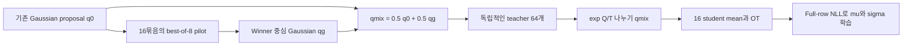

# Best-of-k를 proposal에 결합하는 OptiQ 실험

Profile `mujoco_v5_bestk_proposal` / `v5/bestk_proposal`, branch `v5_bestk`.
2026-09-15 목표: 기존 OptiQ 컴포넌트를 보존하며 best-k 결합을 검증한다.
**수학·구현 검증과 실제 학습 성공은 별개다. 성능 검증 전에는 성공한 방법으로 표시하지 않는다.**

## 보존하는 목적과 구조

기존 v5의 Boltzmann teacher `p_T(a|s) ∝ exp(Q_mean(s,a)/T)`, 정확한 proposal
밀도 보정 beta=1, 16 student mean의 OT, full-row conditional Gaussian NLL,
continuous latent actor/두 head, teacher sigma floor=.05, plain TD/Kt=1,
paired zero-z/stochastic-z epsilon=0 평가를 유지한다. T는 Hopper .01, Ant .25,
Sinkhorn epsilon=.1 /100 iterations. 256x2, Adam/no clipping, UTD1, 1M steps.

이 프로파일의 수집은 원래 full Gaussian/Kb=1이다. 이전에 실패한 global
best-of-8 수집까지 동시에 적용하지 않고, best-of-8의 teacher proposal 효과를
먼저 분리한다. 수집에 best-k가 활성화된 실험처럼 이름 붙이지 않는다.

## Pilot과 최종 teacher를 분리

고정 상태 s와 student latent 16개에 대해 기존 proposal은 다음과 같다.

`q0(a|s) = (1/16) Σ_i TanhNormal(a; μ_i, max(σ_i,.05))`.

1. q0에서 독립적인 `16묶음 × 8개 = 128개` pilot 행동을 뽑는다.
2. 각 묶음에서 **live twin-mean Q**가 가장 높은 행동의 원래 pre-tanh u와
   그 후보를 생성한 Gaussian component의 floor 적용 scale을 보관한다.
3. 이 winner u 16개를 중심으로, 보관한 scale의 Gaussian mixture qg를 만든다.
4. **qmix = .5 q0 + .5 qg**를 고정하고 새로운 독립 RNG로 teacher 64개를 뽑는다.
5. 최종 teacher에 대해 `log_weight = Q_mean/T - log(qmix)`를 계산한다.
   log(qmix)는 두 Gaussian mixture의 logaddexp와 안정적인 tanh Jacobian으로
   계산한다. 모든 teacher u, parameters, weights, OT plan은 stop-gradient한다.
6. 기존 16×64 mean-action Sinkhorn OT와 각 행 전체의 Gaussian NLL을 그대로 수행한다.

Winner 자체에 q0의 밀도를 잘못 붙여 재가중하지 않는다. Winner는 명시적인
proposal을 만드는 pilot이며, 최종 teacher는 그 proposal에서 **새로 샘플링한
행동**이다. 따라서 실제 winner 밀도 `K q F^(K-1)`의 CDF를 추정할 필요가 없다.

## 왜 Boltzmann 목표가 유지되는가

Pilot 결과 H에 조건을 걸면 qmix(a|s,H)는 완전히 알려진 proposal이다.

`E_{a~qmix(.|s,H)}[ f(a) exp(Q(a)/T) / qmix(a|s,H) ]
 = integral f(a) exp(Q(a)/T) da`.

그러므로 올바른 목표는 기존과 같은 Boltzmann 분포다. 정규화 상수를 sample
weight 합으로 나누는 SNIS는 유한 표본 편향이 있으며, 이는 기존 OptiQ에도
있었다. 이 방법을 유한 표본에서 정확한 Boltzmann sampling이라고 부르지 않는다.

또한 `qmix >= .5 q0`이므로 q0가 덮던 영역을 제거하지 않는다. 동일 행동에서
비정규화 importance weight는 q0를 쓸 때의 2배를 넘지 않는다. 이것만으로
전체 SNIS 분산이나 RL 성능 향상을 보장하지 않는다.

Q로 pilot을 고르는 방법은 추가 sampling 계산을 좋은 영역에 집중시키려는
휴리스틱이다. 부정확한 critic, proposal variance, 유한 후보수 때문에 실패할 수
있다. 성능은 같은 seed/환경 step/평가 프로토콜에서 기존 meanOT와 비교한다.

## 설정과 검증

- `actor.proposal_best_of_k=8`, `actor.proposal_guided_fraction=.5`.
- K=1/fraction=0인 기본 경로는 기존 proposal RNG와 업데이트를 보존한다.
- T/density/OT/NLL을 끄는 조합이나 q0를 없애는 fraction=1은 거부한다.
- 로그: `proposal_best_of_k`, `proposal_guided_fraction`, `proposal_pilot_count`,
  `proposal_pilot_winner_q_gain`, 기존 `temperature`, `density_beta_mean`, `source_ess_absolute`.
- `tests/test_bestk_proposal.py`: 독립 묶음 argmax/scale 보존, 독립 샘플링,
  joint density/tanh Jacobian, 혼합 샘플 moments, quadrature로 Boltzmann 목표 확인,
  잘못된 q0 보정의 오류 확인, gradient 차단/두 head 학습/설정 보존.
- 기존 v4/v5/winner 경로 회귀와 Ant/Hopper batch256 GPU integration도 검사한다.

실험·검증 원본과 비교 기준은 `/root/anal/optiq_bestk_integration_20260915`에
저장한다. Winner-only와 collection-only 과거 소스/결과는 그대로 보존한다.

이 설계는 adaptive/mixture importance sampling의 일반 원리를 사용한다.
참고: [He & Owen, Optimal mixture weights](https://arxiv.org/abs/1411.3954),
[Agapiou et al., Importance Sampling](https://arxiv.org/abs/1511.06196).
두 논문이 이 RL 결합의 성능을 보장한다는 뜻은 아니다.

2026-09-15 구현 검증: CPU 회귀 90개 통과. Ant/Hopper 각각 batch256에서
40회 GPU update와 기존 paired 평가 통과. TD, collector, policy, evaluation,
NLL, Sinkhorn, canonical v5 config는 이전 commit과 동일하다.

## Random-pilot 대조군

`mujoco_v5_random_proposal` / `v5/random_proposal`은 동일한 16×8 IID pilot
묶음에서 argmax 대신 첫 후보를 중심으로 택한다. 첫 후보도 q0의 독립 표본이므로
Q 선택 없는 random-pilot 대조군이다. 추가 RNG를 사용하지 않고 같은 pilot
생성·128개 Q 평가·64개 최종 teacher·정확한 혼합 밀도 보정·OT·NLL을 유지한다.
`actor.proposal_pilot_selection=first`만 알고리즘 설정에 추가한다.

이 대조군은 Gaussian mixture를 확장한 효과와 Q 기반 best-k 선별 효과를
구분한다. 기존 로그 `proposal_pilot_winner_q_gain`은 두 경우 모두 동일한
pool의 잠재적 최대 Q gain이다. 실제 선택의 gain은
`proposal_pilot_selected_q_gain`, 선별 활성 여부는
`proposal_pilot_selects_best`(best=1, random=0)로 구분한다.
Random-pilot에서는 `proposal_best_of_k=8`이 후보 pool 크기이며, argmax를
수행했다는 뜻이 아니다. Run 이름과 metadata에는 random-pilot을 명시한다.

대조군 추가 검증: 관련 CPU 회귀 82개 통과, 실제 Ant/Hopper 각각 8회
update와 paired 평가 통과(짧은 구현 검사이며 학습 성능 실험이 아님).
동일 입력/RNG의 K=1 및 K=8 업데이트를 frozen c846e96과 비교하면 actor,
optimizer, loss, 다음 RNG는 bitwise 동일하다. 비교한 기존 출력 154개 중
153개가 bitwise 동일하고, pilot Q gain 진단값 하나의 차이는 약 1.2e-7이다.

## SAC와 winner 증류의 차이

| 구성 | 기존 OptiQ | Winner-only OT | 현재 proposal 결합안 |
|---|---|---|---|
| Teacher 목표 | exp(Q_mean/T)에 비례 | 현재 actor의 best-of-8 winner law | 기존과 같은 exp(Q_mean/T) |
| Teacher 질량 | exp(Q/T)/q0 정규화 | 독립 winner 64개에 각각 1/64 | exp(Q/T)/qmix 정규화 |
| Actor 업데이트 | Mean OT → full conditional NLL | Mean OT → full conditional NLL | 기존과 동일 |
| Q를 통한 actor 미분 | 없음 | 없음 | 없음 |
| Critic target | Plain TD, Kt=1 | Plain TD, Kt=1 | Plain TD, Kt=1 |

Winner law 자체를 증류할 때 균등 표본 가중치는 타당하다. 그러나 이것은 기존
OptiQ의 Boltzmann 목표를 유지한 것이 아니다. 밀도 보정을 제거한 이유는
argmax 연산 자체가 아니라 **목표를 winner law로 변경했기 때문**이다.

SAC는 actor에서 E[alpha log pi(a|s) - Q(s,a)]를 최소화하고 soft backup을
사용한다. Best-k를 행동 선택에 추가해도 SAC 업데이트를 그대로 두면 이
차이가 남는다. SAC의 actor 손실은 고정 Q의 Boltzmann 분포에 대한 reverse
KL과 연결되지만, OptiQ는 가중 teacher에 대한 OT assignment와 조건부 NLL을
사용하고 현재 v5 critic은 plain TD다. 따라서 밀도 보정 유무 하나로 SAC와
동일한 알고리즘이라고 판단할 수 없다.
참고: [SAC 원논문](https://proceedings.mlr.press/v80/haarnoja18b.html).
