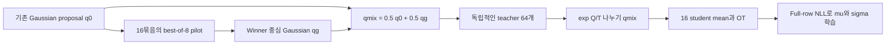

# Best-of-k를 proposal에 결합하는 OptiQ 실험

**과거 실험 설계.** 최신 사용자 지시는 winner 중심 Gaussian과 임의의 혼합을
제거하는 것이다. 새 후보는 [Boltzmann teacher의 직접 best-k 변환](BESTK_BOLTZMANN.md)을
참고한다. 아래는 기존 실행의 재현과 해석을 위해 보존한 기록이다.

Profile `mujoco_v5_bestk_proposal` / `v5/bestk_proposal`, branch `v5_bestk`.
2026-09-15 목표: 기존 OptiQ 컴포넌트를 보존하며 best-k 결합을 검증한다.
**수학·구현 검증과 실제 학습 성공은 별개다. 성능 검증 전에는 성공한 방법으로 표시하지 않는다.**

[완료된 seed0 1M 비교와 현재 결합 실험 결과](BESTK_RESULTS.md)를 별도로 기록한다.

## 보존하는 목적과 구조

기존 v5의 Boltzmann teacher `p_T(a|s) ∝ exp(Q_mean(s,a)/T)`, 정확한 proposal
밀도 보정 beta=1, 16 student mean의 OT, full-row conditional Gaussian NLL,
continuous latent actor/두 head, teacher sigma floor=.05, plain TD/Kt=1,
paired zero-z/stochastic-z epsilon=0 평가를 유지한다. T는 Hopper .01, Ant .25,
Sinkhorn epsilon=.1 /100 iterations. 256x2, Adam/no clipping, UTD1, 1M steps.

이 프로파일의 수집은 원래 full Gaussian/Kb=1이다. 이전에 실패한 global
best-of-8 수집까지 동시에 적용하지 않고, best-of-8의 teacher proposal 효과를
먼저 분리한다. 수집에 best-k가 활성화된 실험처럼 이름 붙이지 않는다.

## Pilot과 최종 teacher를 분리

고정 상태 s와 student latent 16개에 대해 기존 proposal은 다음과 같다.

`q0(a|s) = (1/16) Σ_i TanhNormal(a; μ_i, max(σ_i,.05))`.

1. q0에서 독립적인 `16묶음 × 8개 = 128개` pilot 행동을 뽑는다.
2. 각 묶음에서 **live twin-mean Q**가 가장 높은 행동의 원래 pre-tanh u와
   그 후보를 생성한 Gaussian component의 floor 적용 scale을 보관한다.
3. 이 winner u 16개를 중심으로, 보관한 scale의 Gaussian mixture qg를 만든다.
4. **qmix = .5 q0 + .5 qg**를 고정하고 새로운 독립 RNG로 teacher 64개를 뽑는다.
5. 최종 teacher에 대해 `log_weight = Q_mean/T - log(qmix)`를 계산한다.
   log(qmix)는 두 Gaussian mixture의 logaddexp와 안정적인 tanh Jacobian으로
   계산한다. 모든 teacher u, parameters, weights, OT plan은 stop-gradient한다.
6. 기존 16×64 mean-action Sinkhorn OT와 각 행 전체의 Gaussian NLL을 그대로 수행한다.

Winner 자체에 q0의 밀도를 잘못 붙여 재가중하지 않는다. Winner는 명시적인
proposal을 만드는 pilot이며, 최종 teacher는 그 proposal에서 **새로 샘플링한
행동**이다. 따라서 실제 winner 밀도 `K q F^(K-1)`의 CDF를 추정할 필요가 없다.

## 왜 Boltzmann 목표가 유지되는가

Pilot 결과 H에 조건을 걸면 qmix(a|s,H)는 완전히 알려진 proposal이다.

`E_{a~qmix(.|s,H)}[ f(a) exp(Q(a)/T) / qmix(a|s,H) ]
 = integral f(a) exp(Q(a)/T) da`.

그러므로 올바른 목표는 기존과 같은 Boltzmann 분포다. 정규화 상수를 sample
weight 합으로 나누는 SNIS는 유한 표본 편향이 있으며, 이는 기존 OptiQ에도
있었다. 이 방법을 유한 표본에서 정확한 Boltzmann sampling이라고 부르지 않는다.

또한 `qmix >= .5 q0`이므로 q0가 덮던 영역을 제거하지 않는다. 동일 행동에서
비정규화 importance weight는 q0를 쓸 때의 2배를 넘지 않는다. 이것만으로
전체 SNIS 분산이나 RL 성능 향상을 보장하지 않는다.

Q로 pilot을 고르는 방법은 추가 sampling 계산을 좋은 영역에 집중시키려는
휴리스틱이다. 부정확한 critic, proposal variance, 유한 후보수 때문에 실패할 수
있다. 성능은 같은 seed/환경 step/평가 프로토콜에서 기존 meanOT와 비교한다.

## 설정과 검증

- `actor.proposal_best_of_k=8`, `actor.proposal_guided_fraction=.5`.
- K=1/fraction=0인 기본 경로는 기존 proposal RNG와 업데이트를 보존한다.
- T/density/OT/NLL을 끄는 조합이나 q0를 없애는 fraction=1은 거부한다.
- 로그: `proposal_best_of_k`, `proposal_guided_fraction`, `proposal_pilot_count`,
  `proposal_pilot_winner_q_gain`, 기존 `temperature`, `density_beta_mean`, `source_ess_absolute`.
- `tests/test_bestk_proposal.py`: 독립 묶음 argmax/scale 보존, 독립 샘플링,
  joint density/tanh Jacobian, 혼합 샘플 moments, quadrature로 Boltzmann 목표 확인,
  잘못된 q0 보정의 오류 확인, gradient 차단/두 head 학습/설정 보존.
- 기존 v4/v5/winner 경로 회귀와 Ant/Hopper batch256 GPU integration도 검사한다.

실험·검증 원본과 비교 기준은 `/root/anal/optiq_bestk_integration_20260915`에
저장한다. Winner-only와 collection-only 과거 소스/결과는 그대로 보존한다.

2026-09-15 최신 사용자 지시에 따라, 회복 추세나 가능성이 있는 실험은 최대
1M까지 관찰하되 지속적으로 부진한 실험은 근거를 기록하고 조기 중단한다.
두 평가 모드의 연속 50K 구간과 같은 seed의 mean OT를 비교하며, 한 번의
낮은 점수로 중단하지 않는다. 중단한 실험은 부분 결과로만 보고한다.
이 기준으로 기존 winner-only seed0 두 개를 중단하고, GPU2/3에 아래의
전체 결합 조건을 새 seed0부터 우선 배치했다. GPU0/1의 proposal-only
실험과 seed1 큐는 유지한다. Random-pilot 대조군은 우선순위를 뒤로 미뤘다.
실행 소스는 검증한 `88690ae`, 캠페인은
`/root/optiq-experiments/optiq_bestk_combined_priority_v5_20260915`이다.
구체적 판단 근거는 분석 폴더의 `ADAPTIVE_DECISION_20260915.json`에 남겼다.

이 설계는 adaptive/mixture importance sampling의 일반 원리를 사용한다.
참고: [He & Owen, Optimal mixture weights](https://arxiv.org/abs/1411.3954),
[Agapiou et al., Importance Sampling](https://arxiv.org/abs/1511.06196).
두 논문이 이 RL 결합의 성능을 보장한다는 뜻은 아니다.

## 행동 수집까지 결합하는 조건

`mujoco_v5_bestk_combined` / `v5/bestk_combined`는 위 proposal-only 조건에
`alg.behavior_best_of_k=8`만 추가한다. Warmup5K 이후 full Gaussian 후보8개
중 live twin-min Q로 행동을 선택하고, 실행한 행동을 replay에 저장한다.
Teacher pilot은 원래 OptiQ 목표와 같은 twin-mean Q로 고른다. 서로 역할이
다르며, 수집의 min-Q를 teacher의 Q 정의에 덮어쓰지 않는다.

수집의 Q 집계 방식은 별도 고정 체크포인트 진단으로도 비교했다. 4개
체크포인트에 대해 min8/mean8 각각 동일한 10개 episode seed를 사용한
총 80개 CPU episode에서, 실패한 즉시 결합 Ant250K는 −5.1 → −5.2,
Hopper150K는 365.5 → 366.7로 평균 Q 선택만으로 회복하지 않았다.
학습된 proposal-only400K는 Ant2274.0 → 2183.4, Hopper2981.4 → 3356.3으로
혼합된 결과였다. Episode는 학습 seed 반복이 아니며, 이 진단으로 전체
학습 실패의 원인이나 집계 방식 변경의 학습 효과를 확정할 수 없다.
따라서 현재 수집 min-Q를 유지한다. 원본은 분석 폴더의
`BEHAVIOR_AGGREGATION_DIAGNOSTIC.md`와 `behavior_aggregation_diagnostic_v1`에 있다.
[QVPO 5.1절](https://proceedings.neurips.cc/paper_files/paper/2024/file/6111371a868af8dcfba0f96ad9e25ae3-Paper-Conference.pdf)은
policy와 critic 업데이트에 최소 Q를 쓴다고 명시하지만, 기존 OptiQ의
mean-Q teacher와 같은 알고리즘이라는 뜻은 아니다.

T, beta1 정확한 proposal 밀도 보정, sigma floor, mean OT, full NLL,
plain TD/Kt1과 기존 두 평가를 모두 유지한다. 평가에는 best-k를 넣지 않는다.
이는 기존 winner-only의 목표 변경과 구분되는 전체 결합 조건이다.
Proposal-only Kb1이 회복하는 것만으로 collection Kb8까지 성공했다고
판단하지 않는다. 같은 seed의 Kb1과 비교해 수집 선택의 기여를 따로 확인한다.

전체 결합 검증: 관련 CPU 회귀85개 통과. Ant/Hopper 각각 batch256에서
40회 update와40회 collection best8을 확인했다. T=.25/.01과 beta1이 활성화되고
plain TD/기존 paired 평가가 유지된다. 별도 실제 경로 검사에서 replay 행동
일치, TD/평가 중 collector selector 미호출, 평가 RNG 격리도 확인했다.
이 검사는 구현 검증이며1M 성능 성공을 의미하지 않는다.

## Best-of-8 수집을 늦게 시작하는 조건

`mujoco_v5_bestk_delayed` / `v5/bestk_delayed`는 전체 결합 조건에
`alg.behavior_best_of_k_start_step=250000`만 추가한다. Uniform warmup은
기존5K이며, 이후250K까지 원래 full Gaussian 행동을 수집한다.
수집 직전 `num_timesteps >= 250000`부터 Kb8을 사용하므로 처음 선별된
행동은250001번째 transition에 저장된다. Teacher pilot guidance는 기존처럼
actor 학습 시작부터 활성화된다. T, beta1, sigma floor, mean OT, full NLL,
TD/Kt1과 두 공식 평가에는 변경이 없다.

지연 전에는 selector와 그 RNG를 호출하지 않는다. 기존 actor draw는 항상
그대로 소비하며, 전환 뒤 그 draw를 후보0으로 포함해 나머지7개와 비교한다.
이 필드가 없거나0이면 기존 warmup 직후 Kb8 동작을 유지한다. 지연 설정은
warmup 이상, 전체 학습 예산 미만이어야 한다. 지연 프로필의 로그
`rollout/behavior_best_of_k`는 전환 전1, 이후8이고,
`rollout/behavior_best_of_k_active`가 실제 활성 여부를 나타낸다.

검증은 실제 Ant/Hopper에서 전환 전 replay/actor·critic·optimizer/학습 및
수집 RNG의 일치, 정확한 전환 시점, 전환 후 실행 행동과 replay의 일치,
TD/평가에서 selector 미호출 및 평가 RNG 격리를 검사한다.
관련 회귀73개 통과. 학습 RNG와 replay RNG까지 포함해 보강한 전환 전
동일성 검사도 Ant/Hopper 각각 통과했다. 이는 같은 코드 버전의 두 설정을
비교한 검사다. Hopper에서 기존 c846e96 보정 버전과 새38e3454 GPU 실행의
5001 checkpoint를 별도로 비교하면 critic은 같지만 actor parameter에는
최대1.49e-7 차이가 있었다. 이 수치 차이의 원인을 확정하지 않았으며,
따라서 Hopper의 기존 실행과250K까지 완전히 같은 trajectory라고 간주하지 않는다.
Ant는 별도로 실제5001/50K/100K/150K/200K/250K actor·critic checkpoint
파일이 기존 proposal-only 실행과 byte 단위로 같고,250K까지 두 모드의 모든
평가 episode return도 일치함을 확인했다. 이는 저장된 결과의 비교이며,
저장하지 않은 replay/RNG 상태를 직접 비교한 것은 아니다.
이 설정은 성능이 입증된 기본값이 아니라 후속 가설이다.

Hopper의 즉시 Kb8 결합은150K 판단 시 두 연속50K 평균이354.8 →367.5로
정체됐다. 최근 구간 meanOT는759.0, proposal-only는2168.4였다.
최신 사용자 조기 중단 허용에 따라 이 실행을178569step에서 중단하고,
GPU3에 지연 결합 seed0를 새로 시작했다(W&B run `lhnxtm8b`, source38e3454).
기존 실행의 마지막175K 평가도367.4였다. 지연 결합 seed1은 뒤에 대기한다.
Ant 즉시 결합도250K에서 최근50K 평균이−4.45/−4.54로 회복하지 못했다.
같은 구간 meanOT는1364.1/1447.8이었다. 중단 직전255K의 최신 평가도
회복이 없음을 확인한 뒤257189step에서 중단했다. 원래 즉시 결합 Ant
seed1 큐를 취소하고, GPU2에 지연 결합 Ant seed0를 새로 시작했다
(W&B run `8xhn2lj7`, source38e3454). 지연 결합 Ant seed1은 뒤에 대기한다.
GPU0/1의 proposal-only 실행은 계속 유지한다. 지연 조건의250K 이전 점수는
수집 Kb8의 성능 증거가 아니며, 전환 후 학습을 반드시 따로 확인한다.

Hopper seed0는 실제250K 로그에서Kb1, 첫 전환 후 로그250181에서Kb8과
활성 플래그1을 확인했다. 같은 로그에서T=.01,밀도 보정beta1,entropy 없는
TD가 유지된다. 테스트한 코드상 첫 선별 transition은250001이지만, 학습
로그가 매 step 기록되는 것은 아니다. 전환 전 마지막50K 평균은
zero-z1764.4/stochastic-z1747.5이며, 활성화 확인 자체는 성능 성공이 아니다.
원본은 분석 폴더의 `DELAYED_HOPPER_ACTIVATION_250K.json`과
`delayed_ant_actual_prefix_comparison.json`에 보존한다.

Ant도 실제250K 로그에서Kb1, 첫 전환 후 로그250556에서Kb8과 활성 플래그1을
확인했다. T=.25,beta1,plainTD는 유지되며 두 환경 모두 온라인 설정·진행과
대조했다. Ant250K의 zero-z/stochastic-z 평균은1368.8/1434.3으로,
기존 proposal-only의 같은 step과 episode 단위까지 일치한다.
`DELAYED_ANT_ACTIVATION_250K.json`에 전환 근거를 남겼다. 이후 실제
수집8 학습의 지속적인 성능 개선은 별도로 검증해야 한다.

후속 상태: Hopper 지연 실행은 지속적인 불안정과 meanOT 대비 부진으로
440300 step에서 중단했고, 원래 Gaussian 수집을 절반 보존하는
[혼합 수집 조건](BESTK_MIXED.md)을 GPU3에서 새로 시작했다. Ant 지연
실행과 GPU0/1 proposal-only 비교는 유지한다. 서로 다른 수집 조건을
동일한 실험으로 합치거나 중단한 Hopper를1M 완료로 표시하지 않는다.

동기는 보정 proposal-only seed0의 별도 고정 체크포인트 진단이다.
400K에서 동일한10개 episode seed로 비교한 실제 수집 보상은 Ant가
Gaussian1 1398.5 → best8 2624.5, Hopper가2695.4 →3404.8이었다.
100K에서는 각각6.0 →10.5,987.4 →1123.3으로 차이가 작았다.
CPU에서 수행한 이 별도 진단은 공식 평가·학습 seed 반복을 대체하지 않으며,
초반 실패 원인이나250K 전환의 성공을 증명하지 않는다. 전체 결합 학습이
부진할 때 지연 시작을 비교할 근거로만 사용한다. 원본:
`/root/anal/optiq_bestk_integration_20260915/behavior_checkpoint_diagnostic_100k_400k`.

2026-09-15 구현 검증: CPU 회귀 90개 통과. Ant/Hopper 각각 batch256에서
40회 GPU update와 기존 paired 평가 통과. TD, collector, policy, evaluation,
NLL, Sinkhorn, canonical v5 config는 이전 commit과 동일하다.

## Random-pilot 대조군

`mujoco_v5_random_proposal` / `v5/random_proposal`은 동일한 16×8 IID pilot
묶음에서 argmax 대신 첫 후보를 중심으로 택한다. 첫 후보도 q0의 독립 표본이므로
Q 선택 없는 random-pilot 대조군이다. 추가 RNG를 사용하지 않고 같은 pilot
생성·128개 Q 평가·64개 최종 teacher·정확한 혼합 밀도 보정·OT·NLL을 유지한다.
`actor.proposal_pilot_selection=first`만 알고리즘 설정에 추가한다.

이 대조군은 Gaussian mixture를 확장한 효과와 Q 기반 best-k 선별 효과를
구분한다. 기존 로그 `proposal_pilot_winner_q_gain`은 두 경우 모두 동일한
pool의 잠재적 최대 Q gain이다. 실제 선택의 gain은
`proposal_pilot_selected_q_gain`, 선별 활성 여부는
`proposal_pilot_selects_best`(best=1, random=0)로 구분한다.
Random-pilot에서는 `proposal_best_of_k=8`이 후보 pool 크기이며, argmax를
수행했다는 뜻이 아니다. Run 이름과 metadata에는 random-pilot을 명시한다.

대조군 추가 검증: 관련 CPU 회귀 82개 통과, 실제 Ant/Hopper 각각 8회
update와 paired 평가 통과(짧은 구현 검사이며 학습 성능 실험이 아님).
동일 입력/RNG의 K=1 및 K=8 업데이트를 frozen c846e96과 비교하면 actor,
optimizer, loss, 다음 RNG는 bitwise 동일하다. 비교한 기존 출력 154개 중
153개가 bitwise 동일하고, pilot Q gain 진단값 하나의 차이는 약 1.2e-7이다.

## SAC와 winner 증류의 차이

| 구성 | 기존 OptiQ | Winner-only OT | 현재 proposal 결합안 |
|---|---|---|---|
| Teacher 목표 | exp(Q_mean/T)에 비례 | 현재 actor의 best-of-8 winner law | 기존과 같은 exp(Q_mean/T) |
| Teacher 질량 | exp(Q/T)/q0 정규화 | 독립 winner 64개에 각각 1/64 | exp(Q/T)/qmix 정규화 |
| Actor 업데이트 | Mean OT → full conditional NLL | Mean OT → full conditional NLL | 기존과 동일 |
| Q를 통한 actor 미분 | 없음 | 없음 | 없음 |
| Critic target | Plain TD, Kt=1 | Plain TD, Kt=1 | Plain TD, Kt=1 |

Winner law 자체를 증류할 때 균등 표본 가중치는 타당하다. 그러나 이것은 기존
OptiQ의 Boltzmann 목표를 유지한 것이 아니다. 밀도 보정을 제거한 이유는
argmax 연산 자체가 아니라 **목표를 winner law로 변경했기 때문**이다.

SAC는 actor에서 E[alpha log pi(a|s) - Q(s,a)]를 최소화하고 soft backup을
사용한다. Best-k를 행동 선택에 추가해도 SAC 업데이트를 그대로 두면 이
차이가 남는다. SAC의 actor 손실은 고정 Q의 Boltzmann 분포에 대한 reverse
KL과 연결되지만, OptiQ는 가중 teacher에 대한 OT assignment와 조건부 NLL을
사용하고 현재 v5 critic은 plain TD다. 따라서 밀도 보정 유무 하나로 SAC와
동일한 알고리즘이라고 판단할 수 없다.
참고: [SAC 원논문](https://proceedings.mlr.press/v80/haarnoja18b.html).
